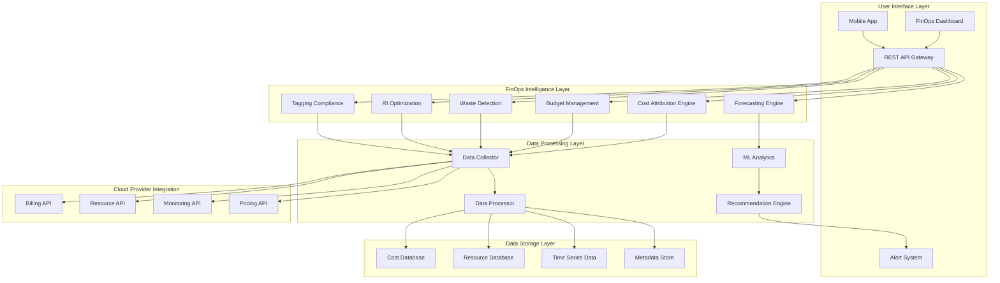
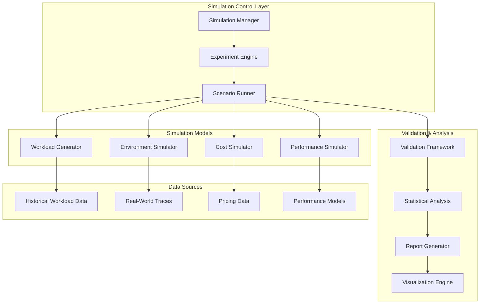

# Design Document

## Overview

The Single-Cloud FinOps Platform is a comprehensive financial operations and cost optimization system designed for organizations operating within a single cloud provider ecosystem. The platform transforms existing cloud management capabilities into a focused FinOps solution that provides deep cost visibility, intelligent optimization recommendations, and automated governance.

The design leverages cloud provider APIs to deliver real-time cost attribution, budget management, waste detection, reserved instance optimization, and tagging compliance. By focusing on a single cloud provider, the platform can provide deeper integration, more accurate recommendations, and simplified operations compared to multi-cloud solutions.

## Architecture

### High-Level Architecture



### Component Architecture

The platform consists of five main architectural layers:

1. **User Interface Layer**: FinOps dashboard, mobile app, REST APIs, and intelligent alerting
2. **FinOps Intelligence Layer**: Core business logic for cost attribution, budget management, waste detection, RI optimization, and tagging compliance
3. **Data Processing Layer**: Data collection, processing, ML analytics, and recommendation generation
4. **Data Storage Layer**: Persistent storage for cost data, resource metadata, time-series metrics, and configuration
5. **Cloud Provider Integration**: Single cloud provider APIs for billing, resources, monitoring, and pricing

## Components and Interfaces

### 1. Cloud Provider Configuration Engine

**Purpose**: Manages cloud provider selection, API configuration, and credential management

**Key Components**:
- `ProviderSelector`: Handles cloud provider selection (AWS, GCP, Azure, others)
- `CredentialManager`: Securely manages API credentials and permissions
- `APIConnector`: Establishes and validates connections to cloud provider APIs
- `ResourceDiscovery`: Discovers existing resources and infrastructure

**Interfaces**:
```python
class CloudProviderEngine:
    def configure_provider(self, provider: CloudProviderType, 
                          credentials: ProviderCredentials) -> ConfigurationResult
    
    def validate_api_access(self, provider_config: ProviderConfig) -> ValidationResult
    
    def discover_resources(self, provider_config: ProviderConfig) -> ResourceInventory
    
    def test_billing_access(self, provider_config: ProviderConfig) -> BillingAccessResult
```

### 2. Cost Attribution Engine

**Purpose**: Comprehensive cost tracking and attribution across teams, projects, and environments

**Key Components**:
- `CostCollector`: Gathers detailed cost data from cloud provider billing APIs
- `TagAnalyzer`: Analyzes resource tags for cost attribution and compliance
- `CostAllocator`: Allocates shared costs using various allocation methods
- `ChargebackCalculator`: Generates accurate chargeback reports for cost centers

**Interfaces**:
```python
class CostAttributionEngine:
    def collect_detailed_costs(self, time_range: TimeRange) -> DetailedCostData
    
    def attribute_costs_by_tags(self, cost_data: CostData, 
                               attribution_rules: AttributionRules) -> AttributedCosts
    
    def allocate_shared_costs(self, shared_costs: SharedCostData, 
                             allocation_method: AllocationMethod) -> AllocatedCosts
    
    def generate_chargeback_report(self, cost_center: str, 
                                  period: BillingPeriod) -> ChargebackReport
    
    def identify_untagged_resources(self) -> List[UntaggedResource]
```

### 3. Budget Management Engine

**Purpose**: Comprehensive budget creation, tracking, and alerting system

**Key Components**:
- `BudgetCreator`: Creates flexible budgets for teams, projects, and services
- `SpendingTracker`: Monitors real-time spending against budgets
- `ForecastEngine`: Predicts future spending based on current trends
- `AlertManager`: Sends proactive alerts before budget overruns

**Interfaces**:
```python
class BudgetManagementEngine:
    def create_budget(self, budget_config: BudgetConfiguration) -> Budget
    
    def track_spending(self, budget: Budget) -> SpendingStatus
    
    def forecast_spending(self, budget: Budget, 
                         forecast_period: int) -> SpendingForecast
    
    def check_alert_conditions(self, budget: Budget) -> List[BudgetAlert]
    
    def generate_budget_report(self, budget: Budget, 
                              period: ReportingPeriod) -> BudgetReport
    
    def recommend_budget_adjustments(self, budget: Budget) -> List[BudgetRecommendation]
```

### 4. Waste Detection Engine

**Purpose**: Identifies unused, underutilized, and oversized resources for cost optimization

**Key Components**:
- `ResourceAnalyzer`: Analyzes resource utilization patterns and efficiency
- `WasteIdentifier`: Identifies various types of waste (unused, idle, oversized)
- `OptimizationCalculator`: Calculates potential savings from optimization actions
- `RiskAssessor`: Assesses risk levels for optimization recommendations

**Interfaces**:
```python
class WasteDetectionEngine:
    def analyze_resource_utilization(self, resources: List[CloudResource], 
                                   analysis_period: int) -> UtilizationAnalysis
    
    def identify_unused_resources(self, utilization_data: UtilizationAnalysis) -> List[UnusedResource]
    
    def identify_underutilized_resources(self, utilization_data: UtilizationAnalysis, 
                                       thresholds: UtilizationThresholds) -> List[UnderutilizedResource]
    
    def identify_oversized_resources(self, utilization_data: UtilizationAnalysis) -> List[OversizedResource]
    
    def calculate_optimization_savings(self, waste_items: List[WasteItem]) -> OptimizationSavings
    
    def assess_optimization_risk(self, optimization: OptimizationRecommendation) -> RiskAssessment
```

### 5. Reserved Instance Optimization Engine

**Purpose**: Intelligent recommendations for reserved instances and savings plans

**Key Components**:
- `UsageAnalyzer`: Analyzes historical usage patterns for stable workloads
- `RIRecommendationEngine`: Generates optimal RI purchase recommendations
- `SavingsCalculator`: Calculates potential savings from different commitment options
- `UtilizationTracker`: Monitors RI utilization and identifies optimization opportunities

**Interfaces**:
```python
class RIOptimizationEngine:
    def analyze_usage_patterns(self, resources: List[CloudResource], 
                              analysis_period: int) -> UsagePatternAnalysis
    
    def generate_ri_recommendations(self, usage_analysis: UsagePatternAnalysis, 
                                   commitment_preferences: CommitmentPreferences) -> List[RIRecommendation]
    
    def calculate_ri_savings(self, recommendation: RIRecommendation) -> SavingsAnalysis
    
    def track_ri_utilization(self, reserved_instances: List[ReservedInstance]) -> UtilizationReport
    
    def identify_ri_optimization_opportunities(self, ri_portfolio: RIPortfolio) -> List[RIOptimization]
    
    def compare_commitment_options(self, workload: WorkloadProfile) -> CommitmentComparison
```

### 6. Tagging Compliance Engine

**Purpose**: Automated tagging compliance monitoring and enforcement

**Key Components**:
- `TagPolicyManager`: Manages tagging policies and compliance rules
- `ComplianceMonitor`: Monitors resources for tagging compliance violations
- `TagSuggestionEngine`: Suggests appropriate tags based on patterns and context
- `GovernanceEnforcer`: Enforces tagging policies through automated actions

**Interfaces**:
```python
class TaggingComplianceEngine:
    def define_tagging_policy(self, policy: TaggingPolicy) -> PolicyResult
    
    def monitor_compliance(self, resources: List[CloudResource]) -> ComplianceReport
    
    def identify_violations(self, compliance_report: ComplianceReport) -> List[TaggingViolation]
    
    def suggest_tags(self, resource: CloudResource, 
                    context: ResourceContext) -> List[TagSuggestion]
    
    def enforce_policy(self, violation: TaggingViolation, 
                      enforcement_action: EnforcementAction) -> EnforcementResult
    
    def generate_compliance_metrics(self, time_period: TimeRange) -> ComplianceMetrics
```

## Data Models

### Core FinOps Data Models

```python
@dataclass
class CloudProvider:
    """Cloud provider configuration"""
    provider_type: CloudProviderType  # AWS, GCP, AZURE, OTHER
    provider_name: str
    credentials: ProviderCredentials
    billing_account_id: str
    regions: List[str]
    api_endpoints: Dict[str, str]
    
@dataclass
class CloudResource:
    """Generic cloud resource with cost and utilization data"""
    resource_id: str
    resource_type: ResourceType
    provider: CloudProvider
    region: str
    tags: Dict[str, str]
    cost_data: ResourceCostData
    utilization_metrics: UtilizationMetrics
    created_date: datetime
    
@dataclass
class ResourceCostData:
    """Cost information for a cloud resource"""
    hourly_cost: float
    monthly_cost: float
    cost_breakdown: Dict[str, float]  # compute, storage, network, etc.
    pricing_model: PricingModel  # on-demand, reserved, spot
    last_updated: datetime
    
@dataclass
class UtilizationMetrics:
    """Resource utilization metrics"""
    cpu_utilization: float
    memory_utilization: float
    storage_utilization: float
    network_utilization: float
    measurement_period: TimeRange
    average_utilization: float
```

### Financial Data Models

```python
@dataclass
class CostData:
    provider: str
    service: str
    resource_id: str
    cost_amount: float
    currency: str
    billing_period: TimeRange
    cost_category: CostCategory
    tags: Dict[str, str]
    
@dataclass
class Budget:
    budget_id: str
    name: str
    amount: float
    period: BudgetPeriod
    alert_thresholds: List[float]
    scope: BudgetScope
    
@dataclass
class CostOptimization:
    optimization_type: OptimizationType
    current_cost: float
    optimized_cost: float
    potential_savings: float
    confidence_score: float
    implementation_effort: EffortLevel
    recommendation: str
```

### Performance Data Models

```python
@dataclass
class Anomaly:
    anomaly_id: str
    resource_id: str
    metric_type: MetricType
    severity: SeverityLevel
    detected_at: datetime
    description: str
    suggested_actions: List[str]
    
@dataclass
class ScalingRecommendation:
    resource_id: str
    current_capacity: ResourceCapacity
    recommended_capacity: ResourceCapacity
    scaling_direction: ScalingDirection
    confidence_score: float
    estimated_cost_impact: float
    rationale: str
```

### Simulation Data Models

```python
@dataclass
class WorkloadPattern:
    """Defines patterns for generating realistic workload traces"""
    pattern_type: PatternType  # CONSTANT, PERIODIC, BURSTY, RANDOM_WALK
    base_intensity: float
    variation_amplitude: float
    seasonal_components: List[SeasonalComponent]
    noise_level: float
    
@dataclass
class WorkloadTrace:
    """Generated sequence of workloads for simulation"""
    workloads: List[Workload]
    generation_parameters: WorkloadPattern
    metadata: Dict[str, Any]
    duration_hours: int
    total_workloads: int
    
@dataclass
class SimulatedEnvironment:
    """Virtual cloud environment for simulation"""
    providers: List[SimulatedCloudProvider]
    network_topology: NetworkTopology
    failure_scenarios: List[FailureScenario]
    pricing_models: Dict[str, PricingModel]
    constraints: EnvironmentConstraints
    
@dataclass
class SimulationResults:
    """Comprehensive results from simulation run"""
    scheduler_performance: SchedulerMetrics
    cost_analysis: CostAnalysis
    resource_utilization: UtilizationMetrics
    sla_compliance: SLAMetrics
    execution_timeline: List[ExecutionEvent]
    summary_statistics: Dict[str, float]
    
@dataclass
class SchedulerMetrics:
    """Performance metrics for scheduler evaluation"""
    success_rate: float
    average_placement_time: float
    resource_efficiency: float
    load_balancing_score: float
    cost_optimization_score: float
    
@dataclass
class CostSimulationResults:
    """Results from cost-focused simulation scenarios"""
    total_cost: float
    cost_breakdown_by_provider: Dict[str, float]
    cost_breakdown_by_service: Dict[str, float]
    optimization_opportunities: List[CostOptimization]
    cost_trends: List[CostDataPoint]
    roi_analysis: ROIAnalysis
    
@dataclass
class Scenario:
    """Simulation scenario definition"""
    scenario_id: str
    name: str
    description: str
    workload_pattern: WorkloadPattern
    environment_config: EnvironmentConstraints
    duration_hours: int
    success_criteria: List[SuccessCriterion]
    
@dataclass
class ComparisonReport:
    """Results comparing multiple algorithms/strategies"""
    algorithms_tested: List[str]
    scenarios_tested: List[str]
    performance_comparison: Dict[str, SchedulerMetrics]
    cost_comparison: Dict[str, float]
    statistical_significance: Dict[str, float]
    recommendations: List[str]
    
@dataclass
class ValidationReport:
    """Validation of simulation accuracy against real-world data"""
    accuracy_metrics: Dict[str, float]
    correlation_analysis: Dict[str, float]
    deviation_analysis: DeviationAnalysis
    confidence_intervals: Dict[str, ConfidenceInterval]
    validation_status: ValidationStatus
```

## Error Handling

### Error Categories and Strategies

1. **Cloud Provider API Errors**
   - Implement exponential backoff with jitter
   - Circuit breaker pattern for failing providers
   - Graceful degradation when providers are unavailable
   - Comprehensive error logging and alerting

2. **Data Collection Errors**
   - Retry mechanisms for transient failures
   - Data validation and sanitization
   - Fallback to cached data when real-time data unavailable
   - Error aggregation and reporting

3. **ML Model Errors**
   - Model validation and performance monitoring
   - Fallback to rule-based systems when models fail
   - Continuous model retraining and validation
   - A/B testing for model improvements

4. **System Integration Errors**
   - Health checks for all external dependencies
   - Timeout handling for long-running operations
   - Transaction rollback for failed operations
   - Comprehensive audit logging

### Error Handling Implementation

```python
class ErrorHandler:
    def handle_api_error(self, error: APIError, context: RequestContext) -> ErrorResponse:
        """Handle cloud provider API errors with appropriate retry logic"""
        
    def handle_data_error(self, error: DataError, operation: str) -> DataErrorResponse:
        """Handle data collection and validation errors"""
        
    def handle_ml_error(self, error: MLError, model: str) -> MLErrorResponse:
        """Handle machine learning model errors with fallback strategies"""
        
    def log_error(self, error: Exception, context: Dict[str, Any]) -> None:
        """Comprehensive error logging with context"""
```

## Simulation Framework Design

### Simulation Architecture

The simulation framework provides a comprehensive testing and validation environment that models real-world cloud scenarios without incurring actual costs or risks.



### Simulation Capabilities

1. **Workload Simulation**
   - **Realistic Workload Generation**: Creates workload traces based on real-world patterns
   - **Pattern Modeling**: Supports constant, periodic, bursty, and random walk patterns
   - **Seasonal Variations**: Models daily, weekly, and monthly usage cycles
   - **Scaling Scenarios**: Tests system behavior under different load levels

2. **Environment Simulation**
   - **Multi-Cloud Modeling**: Simulates AWS, GCP, Azure environments with realistic constraints
   - **Failure Scenarios**: Models provider outages, network issues, and resource failures
   - **Pricing Dynamics**: Simulates spot pricing, reserved instances, and pricing changes
   - **Geographic Distribution**: Models latency and data residency constraints

3. **Algorithm Validation**
   - **A/B Testing**: Compares different scheduling algorithms systematically
   - **Performance Benchmarking**: Measures scheduler performance across scenarios
   - **Cost Optimization Testing**: Validates cost-saving strategies
   - **Scalability Analysis**: Tests algorithm performance with increasing load

4. **Predictive Simulation**
   - **What-If Analysis**: Models outcomes of different strategic decisions
   - **Capacity Planning**: Predicts resource needs for future growth
   - **Cost Forecasting**: Projects costs under different usage scenarios
   - **Risk Assessment**: Models impact of various failure scenarios

### Simulation Implementation

```python
class SimulationFramework:
    def __init__(self):
        self.workload_generator = WorkloadGenerator()
        self.environment_simulator = EnvironmentSimulator()
        self.cost_simulator = CostSimulator()
        self.performance_simulator = PerformanceSimulator()
        self.validation_framework = ValidationFramework()
    
    def run_comprehensive_simulation(self, config: SimulationConfig) -> SimulationResults:
        """Run complete simulation with all components"""
        
        # Generate workload trace
        workload_trace = self.workload_generator.generate_trace(
            pattern=config.workload_pattern,
            duration=config.duration_hours,
            scale=config.scale_factor
        )
        
        # Create simulated environment
        environment = self.environment_simulator.create_environment(
            providers=config.cloud_providers,
            constraints=config.environment_constraints
        )
        
        # Run scheduling simulation
        scheduling_results = self.run_scheduling_simulation(
            scheduler=config.scheduler,
            workloads=workload_trace,
            environment=environment
        )
        
        # Simulate costs
        cost_results = self.cost_simulator.simulate_costs(
            scheduling_results=scheduling_results,
            pricing_models=environment.pricing_models
        )
        
        # Simulate performance
        performance_results = self.performance_simulator.simulate_performance(
            scheduling_results=scheduling_results,
            environment=environment
        )
        
        # Validate results
        validation_results = self.validation_framework.validate_results(
            simulation_results=scheduling_results,
            real_world_baseline=config.validation_baseline
        )
        
        return SimulationResults(
            scheduler_performance=scheduling_results,
            cost_analysis=cost_results,
            performance_analysis=performance_results,
            validation_report=validation_results
        )
```

## Testing Strategy

### Testing Approach

1. **Unit Testing**
   - Test individual components in isolation
   - Mock external dependencies (cloud APIs, databases)
   - Achieve >90% code coverage
   - Focus on business logic and edge cases

2. **Integration Testing**
   - Test component interactions
   - Use test doubles for external services
   - Validate data flow between components
   - Test error propagation and handling

3. **Simulation-Based Testing**
   - **Algorithm Validation**: Test scheduling algorithms with simulated workloads
   - **Stress Testing**: Use simulation to test system limits safely
   - **Regression Testing**: Ensure changes don't degrade performance
   - **Scenario Testing**: Test edge cases and failure scenarios

4. **Performance Testing**
   - Load testing for high-volume scenarios
   - Stress testing for resource limits
   - Latency testing for real-time operations
   - Scalability testing for growth scenarios

5. **End-to-End Testing**
   - Complete workflow testing
   - User journey validation
   - Cross-provider functionality testing
   - Disaster recovery testing

### Test Data Strategy

```python
class TestDataFactory:
    def create_test_workloads(self, count: int, complexity: TestComplexity) -> List[Workload]:
        """Generate realistic test workloads"""
        
    def create_test_vms(self, providers: List[str], sizes: List[str]) -> List[VirtualMachine]:
        """Create test VM configurations"""
        
    def create_cost_data(self, time_range: TimeRange, providers: List[str]) -> CostData:
        """Generate realistic cost data for testing"""
        
    def create_performance_metrics(self, resources: List[str], duration: int) -> MetricsData:
        """Generate performance metrics for testing"""
```

### Testing Infrastructure

- **Continuous Integration**: Automated testing on every commit
- **Test Environments**: Separate environments for unit, integration, and E2E testing
- **Test Data Management**: Automated test data generation and cleanup
- **Performance Benchmarking**: Automated performance regression testing
- **Security Testing**: Automated security vulnerability scanning

## Security Considerations

### Security Architecture

1. **Authentication & Authorization**
   - Multi-factor authentication for all users
   - Role-based access control (RBAC)
   - API key management for service-to-service communication
   - OAuth 2.0 integration for third-party services

2. **Data Protection**
   - Encryption at rest for all sensitive data
   - Encryption in transit using TLS 1.3
   - Data masking for non-production environments
   - Secure key management using cloud provider key services

3. **Network Security**
   - VPC isolation for cloud resources
   - Network segmentation and firewall rules
   - API rate limiting and DDoS protection
   - Secure communication channels

4. **Compliance & Auditing**
   - Comprehensive audit logging
   - Compliance reporting (SOC2, GDPR, HIPAA)
   - Data residency controls
   - Regular security assessments

### Security Implementation

```python
class SecurityManager:
    def authenticate_user(self, credentials: UserCredentials) -> AuthenticationResult:
        """Multi-factor authentication implementation"""
        
    def authorize_action(self, user: User, action: Action, resource: Resource) -> bool:
        """Role-based authorization check"""
        
    def encrypt_sensitive_data(self, data: Any) -> EncryptedData:
        """Encrypt sensitive data using appropriate algorithms"""
        
    def audit_action(self, user: User, action: Action, result: ActionResult) -> None:
        """Comprehensive audit logging"""
```

## Deployment Architecture

### Infrastructure Components

1. **Application Tier**
   - Containerized microservices using Docker
   - Kubernetes orchestration for scalability
   - Load balancers for high availability
   - Auto-scaling based on demand

2. **Data Tier**
   - PostgreSQL for relational data
   - InfluxDB for time-series metrics
   - Redis for caching and session storage
   - Object storage for reports and logs

3. **Monitoring & Observability**
   - Prometheus for metrics collection
   - Grafana for visualization
   - ELK stack for log aggregation
   - Distributed tracing with Jaeger

### Deployment Strategy

```yaml
# Kubernetes deployment example
apiVersion: apps/v1
kind: Deployment
metadata:
  name: cloud-intelligence-platform
spec:
  replicas: 3
  selector:
    matchLabels:
      app: cloud-intelligence-platform
  template:
    metadata:
      labels:
        app: cloud-intelligence-platform
    spec:
      containers:
      - name: api-server
        image: cloud-intelligence-platform:latest
        ports:
        - containerPort: 8000
        env:
        - name: DATABASE_URL
          valueFrom:
            secretKeyRef:
              name: db-secret
              key: url
        resources:
          requests:
            memory: "512Mi"
            cpu: "250m"
          limits:
            memory: "1Gi"
            cpu: "500m"
```

This design provides a comprehensive foundation for building the Cloud Intelligence Platform by extending your existing multi-cloud scheduler with sophisticated FinOps and performance monitoring capabilities. The architecture is designed to be scalable, secure, and maintainable while providing the advanced features needed for enterprise cloud management.