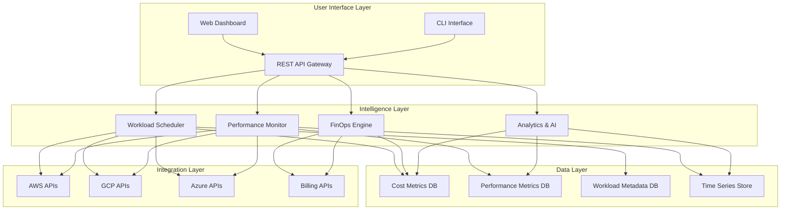
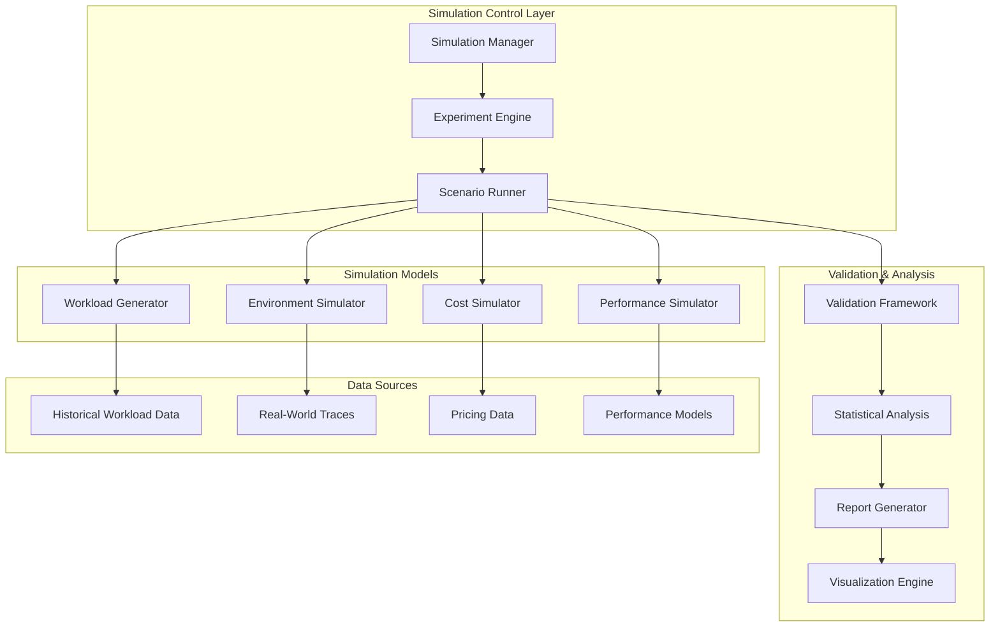

# Design Document

## Overview

The Cloud Intelligence Platform is a comprehensive multi-cloud management system that enhances the existing multi-cloud scheduler with advanced financial operations (FinOps) and performance monitoring capabilities. The platform provides unified visibility, cost optimization, and intelligent resource management across AWS, GCP, Azure, and other cloud providers.

The design leverages the existing foundation of ML-powered workload scheduling while adding sophisticated cost tracking, performance monitoring, and predictive analytics to create a complete cloud intelligence solution.

## Architecture

### High-Level Architecture



### Component Architecture

The platform consists of four main architectural layers:

1. **User Interface Layer**: Web dashboard, REST APIs, and CLI tools
2. **Intelligence Layer**: Core business logic for scheduling, cost management, and monitoring
3. **Data Layer**: Persistent storage for metrics, metadata, and time-series data
4. **Integration Layer**: Cloud provider APIs and billing system integrations

## Components and Interfaces

### 1. Enhanced Workload Scheduler

**Purpose**: Extends existing scheduler with cost and performance awareness

**Key Components**:
- `IntelligentScheduler`: ML-enhanced scheduler considering cost, performance, and compliance
- `CostAwareScheduler`: Optimizes placement based on real-time pricing
- `PerformanceScheduler`: Places workloads based on historical performance data
- `HybridScheduler`: Combines multiple scheduling strategies

**Interfaces**:
```python
class EnhancedScheduler:
    def select_vm(self, workload: Workload, vms: List[VirtualMachine], 
                  cost_constraints: CostConstraints = None,
                  performance_requirements: PerformanceRequirements = None) -> VirtualMachine
    
    def predict_placement_outcome(self, workload: Workload, vm: VirtualMachine) -> PlacementPrediction
    
    def get_optimization_recommendations(self, current_state: ClusterState) -> List[Recommendation]
```

### 2. FinOps Intelligence Engine

**Purpose**: Comprehensive cost management and financial optimization

**Key Components**:
- `CostCollector`: Gathers cost data from cloud provider billing APIs
- `CostAnalyzer`: Analyzes spending patterns and identifies optimization opportunities
- `BudgetManager`: Manages budgets, alerts, and spending controls
- `CostPredictor`: ML-based cost forecasting and trend analysis

**Interfaces**:
```python
class FinOpsEngine:
    def collect_cost_data(self, providers: List[CloudProvider], 
                         time_range: TimeRange) -> CostData
    
    def analyze_spending_patterns(self, cost_data: CostData) -> SpendingAnalysis
    
    def predict_costs(self, historical_data: CostData, 
                     forecast_period: int) -> CostForecast
    
    def generate_optimization_recommendations(self, analysis: SpendingAnalysis) -> List[CostOptimization]
    
    def track_budget_utilization(self, budget: Budget) -> BudgetStatus
```

### 3. Performance & Health Monitor

**Purpose**: Continuous monitoring and performance optimization

**Key Components**:
- `MetricsCollector`: Collects performance metrics from cloud resources
- `AnomalyDetector`: ML-based anomaly detection for performance issues
- `HealthChecker`: Monitors resource health and availability
- `PerformanceAnalyzer`: Analyzes performance trends and capacity planning

**Interfaces**:
```python
class PerformanceMonitor:
    def collect_metrics(self, resources: List[CloudResource], 
                       metrics: List[MetricType]) -> MetricsData
    
    def detect_anomalies(self, metrics_data: MetricsData) -> List[Anomaly]
    
    def analyze_performance_trends(self, historical_metrics: MetricsData) -> PerformanceTrends
    
    def generate_scaling_recommendations(self, analysis: PerformanceTrends) -> List[ScalingRecommendation]
    
    def check_resource_health(self, resource: CloudResource) -> HealthStatus
```

### 4. Analytics & AI Engine

**Purpose**: Advanced analytics and machine learning capabilities

**Key Components**:
- `PredictiveModels`: ML models for cost, performance, and capacity prediction
- `RecommendationEngine`: Generates intelligent recommendations
- `ReportGenerator`: Creates comprehensive reports and dashboards
- `AlertManager`: Manages intelligent alerting and notifications

**Interfaces**:
```python
class AnalyticsEngine:
    def train_prediction_models(self, training_data: TrainingData) -> ModelMetrics
    
    def generate_recommendations(self, context: AnalysisContext) -> List[Recommendation]
    
    def create_executive_report(self, time_period: TimeRange) -> ExecutiveReport
    
    def process_alert_conditions(self, current_state: SystemState) -> List[Alert]
```

### 5. Simulation & Modeling Engine

**Purpose**: Comprehensive simulation framework for testing, validation, and research

**Key Components**:
- `WorkloadSimulator`: Generates realistic workload patterns and traces
- `EnvironmentSimulator`: Models cloud provider environments and constraints
- `ScenarioEngine`: Runs complex multi-variable simulation scenarios
- `ValidationFramework`: Compares simulation results with real-world data
- `ExperimentManager`: Manages A/B testing and algorithm comparison

**Interfaces**:
```python
class SimulationEngine:
    def create_workload_simulation(self, pattern: WorkloadPattern, 
                                 duration: int, scale: int) -> WorkloadTrace
    
    def simulate_environment(self, providers: List[CloudProvider], 
                           constraints: EnvironmentConstraints) -> SimulatedEnvironment
    
    def run_scheduling_simulation(self, scheduler: BaseScheduler, 
                                workloads: WorkloadTrace, 
                                environment: SimulatedEnvironment) -> SimulationResults
    
    def run_cost_simulation(self, scenario: CostScenario, 
                          time_horizon: int) -> CostSimulationResults
    
    def run_performance_simulation(self, load_pattern: LoadPattern,
                                 infrastructure: InfrastructureConfig) -> PerformanceResults
    
    def compare_algorithms(self, algorithms: List[BaseScheduler],
                         test_scenarios: List[Scenario]) -> ComparisonReport
    
    def validate_simulation_accuracy(self, simulation_results: SimulationResults,
                                   real_world_data: RealWorldData) -> ValidationReport
```

## Data Models

### Core Data Models

```python
@dataclass
class EnhancedWorkload(Workload):
    """Extended workload with cost and performance requirements"""
    cost_constraints: Optional[CostConstraints] = None
    performance_requirements: Optional[PerformanceRequirements] = None
    compliance_requirements: Optional[ComplianceRequirements] = None
    priority: WorkloadPriority = WorkloadPriority.NORMAL
    
@dataclass
class CostConstraints:
    max_hourly_cost: float
    max_monthly_budget: float
    cost_optimization_preference: CostOptimizationLevel
    
@dataclass
class PerformanceRequirements:
    min_cpu_performance: float
    max_latency_ms: int
    availability_requirement: float
    throughput_requirement: Optional[int] = None

@dataclass
class EnhancedVirtualMachine(VirtualMachine):
    """Extended VM with performance and cost metrics"""
    current_performance_metrics: PerformanceMetrics
    cost_history: List[CostDataPoint]
    health_status: HealthStatus
    utilization_trends: UtilizationTrends
    
@dataclass
class CostDataPoint:
    timestamp: datetime
    hourly_cost: float
    cumulative_cost: float
    cost_breakdown: Dict[str, float]
    
@dataclass
class PerformanceMetrics:
    cpu_utilization: float
    memory_utilization: float
    network_io: float
    disk_io: float
    response_time_ms: float
    throughput: float
    timestamp: datetime
```

### Financial Data Models

```python
@dataclass
class CostData:
    provider: str
    service: str
    resource_id: str
    cost_amount: float
    currency: str
    billing_period: TimeRange
    cost_category: CostCategory
    tags: Dict[str, str]
    
@dataclass
class Budget:
    budget_id: str
    name: str
    amount: float
    period: BudgetPeriod
    alert_thresholds: List[float]
    scope: BudgetScope
    
@dataclass
class CostOptimization:
    optimization_type: OptimizationType
    current_cost: float
    optimized_cost: float
    potential_savings: float
    confidence_score: float
    implementation_effort: EffortLevel
    recommendation: str
```

### Performance Data Models

```python
@dataclass
class Anomaly:
    anomaly_id: str
    resource_id: str
    metric_type: MetricType
    severity: SeverityLevel
    detected_at: datetime
    description: str
    suggested_actions: List[str]
    
@dataclass
class ScalingRecommendation:
    resource_id: str
    current_capacity: ResourceCapacity
    recommended_capacity: ResourceCapacity
    scaling_direction: ScalingDirection
    confidence_score: float
    estimated_cost_impact: float
    rationale: str
```

### Simulation Data Models

```python
@dataclass
class WorkloadPattern:
    """Defines patterns for generating realistic workload traces"""
    pattern_type: PatternType  # CONSTANT, PERIODIC, BURSTY, RANDOM_WALK
    base_intensity: float
    variation_amplitude: float
    seasonal_components: List[SeasonalComponent]
    noise_level: float
    
@dataclass
class WorkloadTrace:
    """Generated sequence of workloads for simulation"""
    workloads: List[Workload]
    generation_parameters: WorkloadPattern
    metadata: Dict[str, Any]
    duration_hours: int
    total_workloads: int
    
@dataclass
class SimulatedEnvironment:
    """Virtual cloud environment for simulation"""
    providers: List[SimulatedCloudProvider]
    network_topology: NetworkTopology
    failure_scenarios: List[FailureScenario]
    pricing_models: Dict[str, PricingModel]
    constraints: EnvironmentConstraints
    
@dataclass
class SimulationResults:
    """Comprehensive results from simulation run"""
    scheduler_performance: SchedulerMetrics
    cost_analysis: CostAnalysis
    resource_utilization: UtilizationMetrics
    sla_compliance: SLAMetrics
    execution_timeline: List[ExecutionEvent]
    summary_statistics: Dict[str, float]
    
@dataclass
class SchedulerMetrics:
    """Performance metrics for scheduler evaluation"""
    success_rate: float
    average_placement_time: float
    resource_efficiency: float
    load_balancing_score: float
    cost_optimization_score: float
    
@dataclass
class CostSimulationResults:
    """Results from cost-focused simulation scenarios"""
    total_cost: float
    cost_breakdown_by_provider: Dict[str, float]
    cost_breakdown_by_service: Dict[str, float]
    optimization_opportunities: List[CostOptimization]
    cost_trends: List[CostDataPoint]
    roi_analysis: ROIAnalysis
    
@dataclass
class Scenario:
    """Simulation scenario definition"""
    scenario_id: str
    name: str
    description: str
    workload_pattern: WorkloadPattern
    environment_config: EnvironmentConstraints
    duration_hours: int
    success_criteria: List[SuccessCriterion]
    
@dataclass
class ComparisonReport:
    """Results comparing multiple algorithms/strategies"""
    algorithms_tested: List[str]
    scenarios_tested: List[str]
    performance_comparison: Dict[str, SchedulerMetrics]
    cost_comparison: Dict[str, float]
    statistical_significance: Dict[str, float]
    recommendations: List[str]
    
@dataclass
class ValidationReport:
    """Validation of simulation accuracy against real-world data"""
    accuracy_metrics: Dict[str, float]
    correlation_analysis: Dict[str, float]
    deviation_analysis: DeviationAnalysis
    confidence_intervals: Dict[str, ConfidenceInterval]
    validation_status: ValidationStatus
```

## Error Handling

### Error Categories and Strategies

1. **Cloud Provider API Errors**
   - Implement exponential backoff with jitter
   - Circuit breaker pattern for failing providers
   - Graceful degradation when providers are unavailable
   - Comprehensive error logging and alerting

2. **Data Collection Errors**
   - Retry mechanisms for transient failures
   - Data validation and sanitization
   - Fallback to cached data when real-time data unavailable
   - Error aggregation and reporting

3. **ML Model Errors**
   - Model validation and performance monitoring
   - Fallback to rule-based systems when models fail
   - Continuous model retraining and validation
   - A/B testing for model improvements

4. **System Integration Errors**
   - Health checks for all external dependencies
   - Timeout handling for long-running operations
   - Transaction rollback for failed operations
   - Comprehensive audit logging

### Error Handling Implementation

```python
class ErrorHandler:
    def handle_api_error(self, error: APIError, context: RequestContext) -> ErrorResponse:
        """Handle cloud provider API errors with appropriate retry logic"""
        
    def handle_data_error(self, error: DataError, operation: str) -> DataErrorResponse:
        """Handle data collection and validation errors"""
        
    def handle_ml_error(self, error: MLError, model: str) -> MLErrorResponse:
        """Handle machine learning model errors with fallback strategies"""
        
    def log_error(self, error: Exception, context: Dict[str, Any]) -> None:
        """Comprehensive error logging with context"""
```

## Simulation Framework Design

### Simulation Architecture

The simulation framework provides a comprehensive testing and validation environment that models real-world cloud scenarios without incurring actual costs or risks.



### Simulation Capabilities

1. **Workload Simulation**
   - **Realistic Workload Generation**: Creates workload traces based on real-world patterns
   - **Pattern Modeling**: Supports constant, periodic, bursty, and random walk patterns
   - **Seasonal Variations**: Models daily, weekly, and monthly usage cycles
   - **Scaling Scenarios**: Tests system behavior under different load levels

2. **Environment Simulation**
   - **Multi-Cloud Modeling**: Simulates AWS, GCP, Azure environments with realistic constraints
   - **Failure Scenarios**: Models provider outages, network issues, and resource failures
   - **Pricing Dynamics**: Simulates spot pricing, reserved instances, and pricing changes
   - **Geographic Distribution**: Models latency and data residency constraints

3. **Algorithm Validation**
   - **A/B Testing**: Compares different scheduling algorithms systematically
   - **Performance Benchmarking**: Measures scheduler performance across scenarios
   - **Cost Optimization Testing**: Validates cost-saving strategies
   - **Scalability Analysis**: Tests algorithm performance with increasing load

4. **Predictive Simulation**
   - **What-If Analysis**: Models outcomes of different strategic decisions
   - **Capacity Planning**: Predicts resource needs for future growth
   - **Cost Forecasting**: Projects costs under different usage scenarios
   - **Risk Assessment**: Models impact of various failure scenarios

### Simulation Implementation

```python
class SimulationFramework:
    def __init__(self):
        self.workload_generator = WorkloadGenerator()
        self.environment_simulator = EnvironmentSimulator()
        self.cost_simulator = CostSimulator()
        self.performance_simulator = PerformanceSimulator()
        self.validation_framework = ValidationFramework()
    
    def run_comprehensive_simulation(self, config: SimulationConfig) -> SimulationResults:
        """Run complete simulation with all components"""
        
        # Generate workload trace
        workload_trace = self.workload_generator.generate_trace(
            pattern=config.workload_pattern,
            duration=config.duration_hours,
            scale=config.scale_factor
        )
        
        # Create simulated environment
        environment = self.environment_simulator.create_environment(
            providers=config.cloud_providers,
            constraints=config.environment_constraints
        )
        
        # Run scheduling simulation
        scheduling_results = self.run_scheduling_simulation(
            scheduler=config.scheduler,
            workloads=workload_trace,
            environment=environment
        )
        
        # Simulate costs
        cost_results = self.cost_simulator.simulate_costs(
            scheduling_results=scheduling_results,
            pricing_models=environment.pricing_models
        )
        
        # Simulate performance
        performance_results = self.performance_simulator.simulate_performance(
            scheduling_results=scheduling_results,
            environment=environment
        )
        
        # Validate results
        validation_results = self.validation_framework.validate_results(
            simulation_results=scheduling_results,
            real_world_baseline=config.validation_baseline
        )
        
        return SimulationResults(
            scheduler_performance=scheduling_results,
            cost_analysis=cost_results,
            performance_analysis=performance_results,
            validation_report=validation_results
        )
```

## Testing Strategy

### Testing Approach

1. **Unit Testing**
   - Test individual components in isolation
   - Mock external dependencies (cloud APIs, databases)
   - Achieve >90% code coverage
   - Focus on business logic and edge cases

2. **Integration Testing**
   - Test component interactions
   - Use test doubles for external services
   - Validate data flow between components
   - Test error propagation and handling

3. **Simulation-Based Testing**
   - **Algorithm Validation**: Test scheduling algorithms with simulated workloads
   - **Stress Testing**: Use simulation to test system limits safely
   - **Regression Testing**: Ensure changes don't degrade performance
   - **Scenario Testing**: Test edge cases and failure scenarios

4. **Performance Testing**
   - Load testing for high-volume scenarios
   - Stress testing for resource limits
   - Latency testing for real-time operations
   - Scalability testing for growth scenarios

5. **End-to-End Testing**
   - Complete workflow testing
   - User journey validation
   - Cross-provider functionality testing
   - Disaster recovery testing

### Test Data Strategy

```python
class TestDataFactory:
    def create_test_workloads(self, count: int, complexity: TestComplexity) -> List[Workload]:
        """Generate realistic test workloads"""
        
    def create_test_vms(self, providers: List[str], sizes: List[str]) -> List[VirtualMachine]:
        """Create test VM configurations"""
        
    def create_cost_data(self, time_range: TimeRange, providers: List[str]) -> CostData:
        """Generate realistic cost data for testing"""
        
    def create_performance_metrics(self, resources: List[str], duration: int) -> MetricsData:
        """Generate performance metrics for testing"""
```

### Testing Infrastructure

- **Continuous Integration**: Automated testing on every commit
- **Test Environments**: Separate environments for unit, integration, and E2E testing
- **Test Data Management**: Automated test data generation and cleanup
- **Performance Benchmarking**: Automated performance regression testing
- **Security Testing**: Automated security vulnerability scanning

## Security Considerations

### Security Architecture

1. **Authentication & Authorization**
   - Multi-factor authentication for all users
   - Role-based access control (RBAC)
   - API key management for service-to-service communication
   - OAuth 2.0 integration for third-party services

2. **Data Protection**
   - Encryption at rest for all sensitive data
   - Encryption in transit using TLS 1.3
   - Data masking for non-production environments
   - Secure key management using cloud provider key services

3. **Network Security**
   - VPC isolation for cloud resources
   - Network segmentation and firewall rules
   - API rate limiting and DDoS protection
   - Secure communication channels

4. **Compliance & Auditing**
   - Comprehensive audit logging
   - Compliance reporting (SOC2, GDPR, HIPAA)
   - Data residency controls
   - Regular security assessments

### Security Implementation

```python
class SecurityManager:
    def authenticate_user(self, credentials: UserCredentials) -> AuthenticationResult:
        """Multi-factor authentication implementation"""
        
    def authorize_action(self, user: User, action: Action, resource: Resource) -> bool:
        """Role-based authorization check"""
        
    def encrypt_sensitive_data(self, data: Any) -> EncryptedData:
        """Encrypt sensitive data using appropriate algorithms"""
        
    def audit_action(self, user: User, action: Action, result: ActionResult) -> None:
        """Comprehensive audit logging"""
```

## Deployment Architecture

### Infrastructure Components

1. **Application Tier**
   - Containerized microservices using Docker
   - Kubernetes orchestration for scalability
   - Load balancers for high availability
   - Auto-scaling based on demand

2. **Data Tier**
   - PostgreSQL for relational data
   - InfluxDB for time-series metrics
   - Redis for caching and session storage
   - Object storage for reports and logs

3. **Monitoring & Observability**
   - Prometheus for metrics collection
   - Grafana for visualization
   - ELK stack for log aggregation
   - Distributed tracing with Jaeger

### Deployment Strategy

```yaml
# Kubernetes deployment example
apiVersion: apps/v1
kind: Deployment
metadata:
  name: cloud-intelligence-platform
spec:
  replicas: 3
  selector:
    matchLabels:
      app: cloud-intelligence-platform
  template:
    metadata:
      labels:
        app: cloud-intelligence-platform
    spec:
      containers:
      - name: api-server
        image: cloud-intelligence-platform:latest
        ports:
        - containerPort: 8000
        env:
        - name: DATABASE_URL
          valueFrom:
            secretKeyRef:
              name: db-secret
              key: url
        resources:
          requests:
            memory: "512Mi"
            cpu: "250m"
          limits:
            memory: "1Gi"
            cpu: "500m"
```

This design provides a comprehensive foundation for building the Cloud Intelligence Platform by extending your existing multi-cloud scheduler with sophisticated FinOps and performance monitoring capabilities. The architecture is designed to be scalable, secure, and maintainable while providing the advanced features needed for enterprise cloud management.