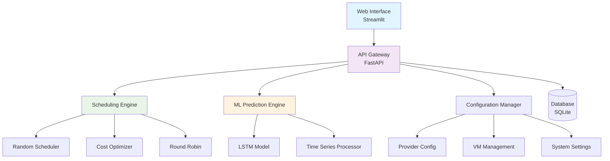

# 🌩️ AI-Powered Cloud Scheduler

> A sophisticated cloud workload scheduling system with multiple algorithms, real-time visualization, and ML-powered CPU usage predictions.


## 📋 Table of Contents

- [Overview](#-overview)
- [Features](#-features)
- [Architecture](#-architecture)
- [Installation](#-installation)
- [Quick Start](#-quick-start)
- [Usage Guide](#-usage-guide)
- [API Documentation](#-api-documentation)
- [Testing](#-testing)
- [Screenshots](#-screenshots)
- [Contributing](#-contributing)

## 🎯 Overview

The AI-Powered Cloud Scheduler is a comprehensive solution for optimizing workload distribution across cloud infrastructure. It combines multiple scheduling algorithms with machine learning capabilities to provide intelligent resource allocation and predictive analytics.

### Key Benefits
- **Cost Optimization**: Minimize cloud spending through intelligent resource allocation
- **Performance Enhancement**: Improve workload distribution and resource utilization  
- **Predictive Analytics**: ML-powered CPU usage forecasting for proactive scaling
- **Multi-Cloud Support**: Works with AWS, GCP, and Azure providers
- **Real-time Monitoring**: Live dashboards and visualization tools

## ✨ Features

### 🔄 Scheduling Algorithms
- **Random Scheduler**: Distributes workloads randomly across available VMs
- **Lowest Cost Scheduler**: Optimizes for minimum cost allocation
- **Round Robin Scheduler**: Ensures balanced distribution across resources

### 🤖 Machine Learning
- **LSTM Neural Network**: Predicts future CPU usage patterns
- **Time Series Analysis**: Analyzes historical performance data
- **Proactive Scaling**: Automated resource recommendations

### 📊 Visualization & Analytics
- **Interactive Dashboards**: Real-time performance monitoring
- **Comparative Analysis**: Side-by-side scheduler performance
- **Cost Analytics**: Detailed spending breakdowns
- **Success Rate Metrics**: Workload assignment efficiency

### 🌐 Web Interface
- **User-Friendly UI**: Intuitive Streamlit-based interface
- **Real-time Updates**: Live data refresh and notifications
- **Configuration Management**: Easy system settings adjustment
- **File Upload Support**: CSV workload import functionality

## 🏗️ Architecture



## 🚀 Installation

### Prerequisites
- Python 3.8 or higher
- pip package manager
- 4GB RAM minimum
- Modern web browser

### Option 1: Using pip (Recommended)

```bash
# Clone the repository
git clone https://github.com/yourusername/ai-cloud-scheduler.git
cd ai-cloud-scheduler

# Create virtual environment
python -m venv venv
source venv/bin/activate  # On Windows: venv\Scripts\activate

# Install dependencies
pip install -r requirements.txt
```

### Option 2: Using conda

```bash
# Create conda environment
conda create -n cloud-scheduler python=3.9
conda activate cloud-scheduler

# Install dependencies
pip install -r requirements.txt
```

### Dependencies

Create a `requirements.txt` file with these packages:

```txt
fastapi==0.104.1
uvicorn[standard]==0.24.0
streamlit==1.28.1
pandas==2.0.3
plotly==5.17.0
requests==2.31.0
pydantic==2.4.2
python-multipart==0.0.6
python-csv==0.0.13
numpy==1.24.3
scikit-learn==1.3.0
tensorflow==2.13.0
```

## ⚡ Quick Start

### 1. Start the API Server

```bash
# Terminal 1: Start the FastAPI backend
python api.py

# You should see:
# 🚀 API Server initialized and ready!
# INFO: Uvicorn running on http://0.0.0.0:8000
```

### 2. Launch the Web Interface

```bash
# Terminal 2: Start the Streamlit frontend
streamlit run streamlit_app.py

# You should see:
# Local URL: http://localhost:8501
# Network URL: http://192.168.1.100:8501
```

### 3. Access the Application

Open your browser and navigate to:
- **Frontend**: http://localhost:8501
- **API Docs**: http://localhost:8000/docs

## 📖 Usage Guide

### Step 1: Configure Your Environment

1. **Navigate to Configuration Tab**
   - Click on "Configuration" in the sidebar
   - Review default cloud providers (AWS, GCP, Azure)
   - Adjust VM configurations as needed

2. **Set Up Workloads**
   - Choose from multiple input methods:
     - Upload CSV file
     - Manual entry
     - Generate random workloads
     - Use sample data

### Step 2: Run Simulations

1. **Go to Simulation Tab**
   - Select one or more scheduling algorithms
   - Configure simulation parameters
   - Click "Start Simulation"

2. **View Results**
   - Navigate to "Results" tab
   - Compare scheduler performance
   - Analyze cost and efficiency metrics

### Step 3: ML Predictions (Optional)

1. **Train the Model**
   - Go to "ML Predictions" tab
   - Upload historical CPU usage data
   - Click "Train Model"

2. **Make Predictions**
   - Input recent CPU usage sequence
   - Generate single or multi-step forecasts
   - Use predictions for capacity planning

## 📝 Sample Data Formats

### Workloads CSV Format
```csv
workload_id,cpu_required,memory_required_gb
1,2,4
2,1,2
3,4,8
4,3,6
```

### CPU Usage Training Data Format
```csv
timestamp,cpu_usage
2023-01-01 00:00:00,45.2
2023-01-01 00:05:00,52.3
2023-01-01 00:10:00,48.1
2023-01-01 00:15:00,55.7
```

## 🔗 API Documentation

### Core Endpoints

#### Providers
- `GET /api/providers/default` - Get default cloud providers
- `POST /api/providers` - Create new provider

#### Virtual Machines  
- `GET /api/vms/default` - Get default VMs
- `POST /api/vms` - Create new VM

#### Workloads
- `GET /api/workloads/sample` - Get sample workloads
- `POST /api/workloads` - Create new workload
- `POST /api/workloads/upload` - Upload CSV workloads
- `POST /api/workloads/generate` - Generate random workloads

#### Simulation
- `POST /api/simulation/run` - Run single scheduler simulation
- `POST /api/simulation/compare` - Compare multiple schedulers

#### Machine Learning
- `GET /api/ml/model-status` - Check model training status
- `POST /api/ml/train` - Train LSTM model
- `POST /api/ml/predict` - Make single prediction
- `POST /api/ml/predict-multiple` - Make multi-step predictions

#### Configuration
- `GET /api/config/show` - Show system configuration overview
- `GET /api/config/{category}` - Get category configuration
- `POST /api/config/{category}` - Update category configuration

### Example API Calls

```bash
# Get sample workloads
curl -X GET "http://localhost:8000/api/workloads/sample"

# Run simulation
curl -X POST "http://localhost:8000/api/simulation/run" \
  -H "Content-Type: application/json" \
  -d '{
    "scheduler_type": "lowest_cost",
    "workloads": [
      {"id": 1, "cpu_required": 2, "memory_required_gb": 4}
    ]
  }'

# Make ML prediction
curl -X POST "http://localhost:8000/api/ml/predict" \
  -H "Content-Type: application/json" \
  -d '[45.2, 52.3, 48.1, 55.7, 42.8, 38.9, 51.2, 47.6, 49.3, 44.1, 53.8, 46.7]'
```

## 🧪 Testing

### Manual Testing Guide

#### 1. Basic Functionality Test
```bash
# Test API health
curl http://localhost:8000/health

# Expected response: {"status": "healthy", "timestamp": "..."}
```

#### 2. Workload Management Test
1. Go to Configuration → Workloads
2. Click "Use Sample Data"
3. Verify workloads appear in the table
4. Try uploading a CSV file
5. Generate random workloads

#### 3. Simulation Test
1. Ensure workloads are loaded
2. Go to Simulation tab
3. Select all three schedulers
4. Run simulation
5. Check Results tab for comparative analysis

#### 4. ML Prediction Test
1. Go to ML Predictions tab
2. Click "Train Model" (uses mock data)
3. Input CPU usage sequence: `45,52,48,56,43,39,51,48,49,44,54,47`
4. Make single prediction
5. Try multi-step prediction with 5 steps

### Automated Testing

Create a test script `test_api.py`:

```python
import requests
import json

API_BASE = "http://localhost:8000"

def test_api_health():
    response = requests.get(f"{API_BASE}/health")
    assert response.status_code == 200
    print("✅ API Health Check Passed")

def test_sample_workloads():
    response = requests.get(f"{API_BASE}/api/workloads/sample")
    assert response.status_code == 200
    workloads = response.json()
    assert len(workloads) > 0
    print(f"✅ Sample Workloads: {len(workloads)} items")

def test_simulation():
    workloads = [{"id": 1, "cpu_required": 2, "memory_required_gb": 4}]
    payload = {"scheduler_type": "random", "workloads": workloads}
    
    response = requests.post(f"{API_BASE}/api/simulation/run", json=payload)
    assert response.status_code == 200
    result = response.json()
    assert "summary" in result
    print("✅ Simulation Test Passed")

if __name__ == "__main__":
    test_api_health()
    test_sample_workloads() 
    test_simulation()
    print("🎉 All tests passed!")
```

Run tests:
```bash
python test_api.py
```

## 🎨 Screenshots

### Dashboard Overview
The main dashboard provides a comprehensive view of your cloud infrastructure status, including VM utilization, scheduler performance, and recent activities.

### Simulation Results
Interactive charts and tables showing comparative performance between different scheduling algorithms, including success rates, costs, and resource utilization.

### ML Predictions Interface
Time series visualization of CPU usage predictions with both historical data and forecasted values displayed in an intuitive chart format.

## 🔧 Troubleshooting

### Common Issues

#### 1. API Connection Error
**Problem**: Frontend shows "🔴 API Offline"
**Solution**: 
```bash
# Check if API server is running
curl http://localhost:8000/health

# If not running, start it:
python api.py
```

#### 2. Import Errors
**Problem**: `ModuleNotFoundError: No module named 'fastapi'`
**Solution**:
```bash
pip install -r requirements.txt
```

#### 3. Port Already in Use
**Problem**: `OSError: [Errno 48] Address already in use`
**Solution**:
```bash
# Find and kill process using port 8000
lsof -ti:8000 | xargs kill -9

# Or use different port
uvicorn api:app --port 8001
```

#### 4. Streamlit Permission Issues
**Problem**: Streamlit won't start
**Solution**:
```bash
# Clear Streamlit cache
streamlit cache clear

# Reset Streamlit configuration
streamlit config show
```

### Performance Optimization

#### 1. Improve API Response Time
- Enable caching in configuration
- Increase worker processes
- Use production ASGI server

#### 2. Handle Large Workloads
- Implement batch processing
- Add pagination to results
- Use async processing for simulations

## 🤝 Contributing

We welcome contributions! Here's how to get started:

### Development Setup

```bash
# Fork the repository
git clone https://github.com/yourusername/ai-cloud-scheduler.git
cd ai-cloud-scheduler

# Create feature branch
git checkout -b feature/your-feature-name

# Install development dependencies
pip install -r requirements-dev.txt

# Make your changes and test
python test_api.py

# Submit pull request
git push origin feature/your-feature-name
```

### Contribution Guidelines

1. **Code Style**: Follow PEP 8 guidelines
2. **Documentation**: Update README and docstrings
3. **Testing**: Add tests for new features
4. **Commit Messages**: Use conventional commit format

## 📄 License

This project is licensed under the MIT License - see the [LICENSE](LICENSE) file for details.

## 🆘 Support

- **Documentation**: Check this README and API docs
- **Issues**: Create GitHub issues for bugs
- **Discussions**: Use GitHub Discussions for questions
- **Email**: support@yourproject.com

## 🚀 What's Next?

### Planned Features
- [ ] Kubernetes integration
- [ ] Real-time monitoring dashboard
- [ ] Advanced ML models (Transformer, GRU)
- [ ] Multi-tenant support
- [ ] Cost optimization recommendations
- [ ] Auto-scaling capabilities

### Version Roadmap
- **v1.1**: Enhanced ML models and real-time monitoring
- **v1.2**: Kubernetes integration and multi-cloud optimization  
- **v2.0**: Enterprise features and advanced analytics

---

**Made with ❤️ by the Cloud Scheduler Team**

*Happy Scheduling! 🌩️*